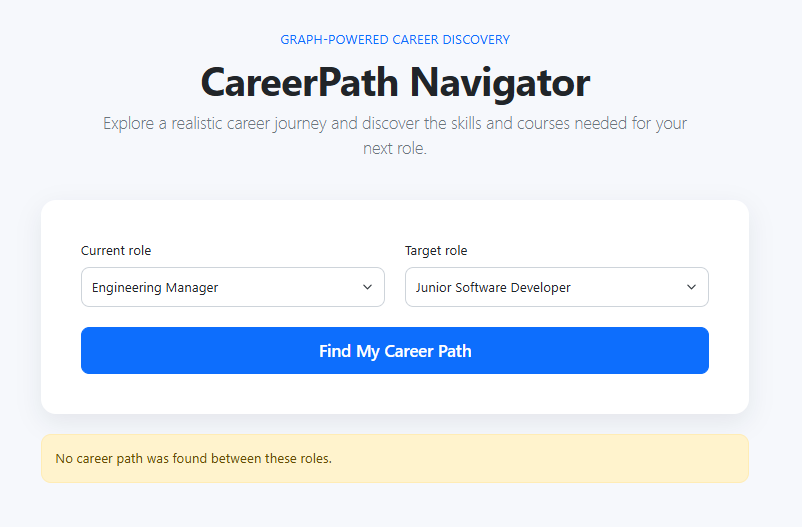

# CareerPath Navigator

A graph-powered web application that helps users explore career progression paths, discover required skills, and find relevant learning courses.

## Why a graph database?

Career progression is about relationships:

- A `Role` can move to another `Role`.
- A `Role` requires one or more `Skill`s.
- A `Course` teaches one or more `Skill`s.

A graph database makes multi-hop career-path queries natural. For example, finding a route from Junior Software Developer to Engineering Manager requires traversing several connected roles. In a relational database, this would require repeated self-joins and becomes harder as the path grows.

## Data model

mermaid
graph LR
    Junior["Junior Software Developer"] -->|CAN_MOVE_TO| Software["Software Engineer"]
    Software -->|CAN_MOVE_TO| Senior["Senior Software Engineer"]
    Senior -->|CAN_MOVE_TO| Lead["Tech Lead"]
    Lead -->|CAN_MOVE_TO| Manager["Engineering Manager"]

    Junior -->|REQUIRES| CSharp["C#"]
    Software -->|REQUIRES| SQL["SQL"]
    Senior -->|REQUIRES| Design["System Design"]
    Lead -->|REQUIRES| Leadership["Leadership"]
    Manager -->|REQUIRES| Leadership

    Course1["C# and .NET Foundations"] -->|TEACHES| CSharp
    Course2["SQL for Developers"] -->|TEACHES| SQL
    Course3["System Design Basics"] -->|TEACHES| Design
    Course4["Leading Technical Teams"] -->|TEACHES| Leadership

## Screenshots

### Career path result

### No-path empty state

